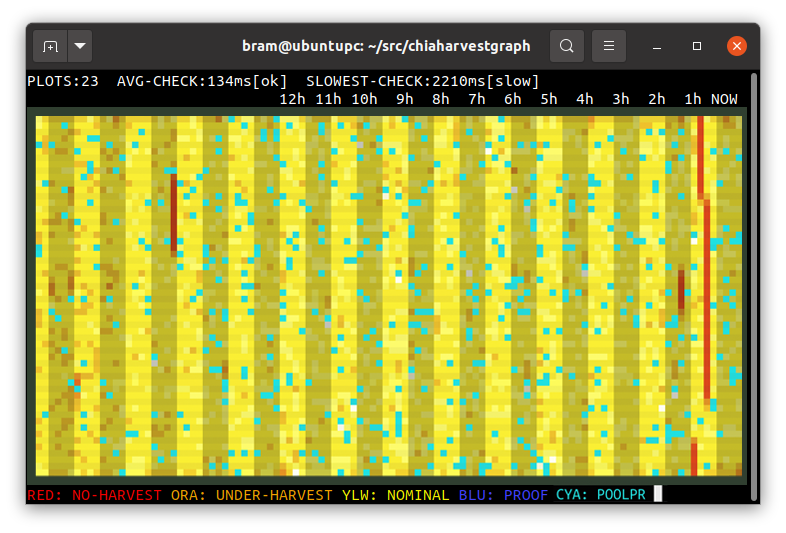

# chiaharvestgraph
Monitor for Chia Harvesting

## Introduction

The chiaharvestgraph tool will graph Chia Harvesting activity in a linux terminal. Use a 24-bit colour terminal, like xterm or gnome-terminal.

Examples:

**$ ./chiaharvestgraph ~/.chia/mainnet/log**

## Keys

Press ESCAPE or Q to exit diskgraph.

## Donations

If you find this tool useful, donations can go to XCH wallet:
xch1zfgqfqfdse3e2x2z9lscm6dx9cvd5j2jjc7pdemxjqp0xp05xzps602592

## Known issues

* Shows garbage on terminals that do not support 24 bit colour.
* Missing manual page.

## Copyright

chiaharvestgraph is (c)2021 by Bram Stolk and licensed under the MIT license.
